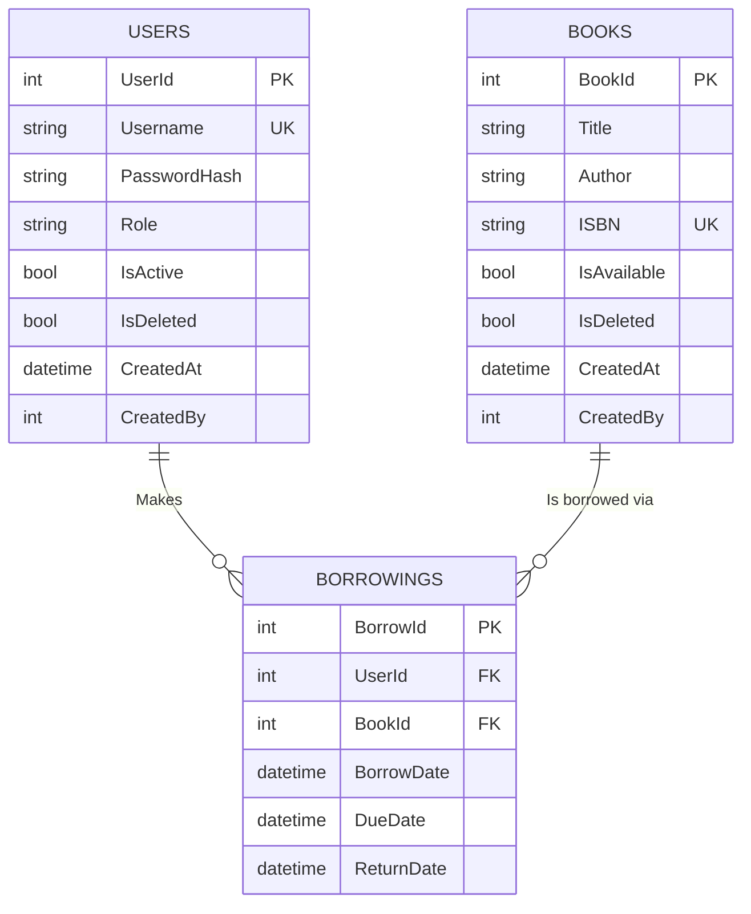

# 📚 Enterprise Library Management System


An enterprise-grade Library Management System built from scratch using **ASP.NET Core MVC 10.0** and strict **Clean Architecture** principles. This project was architected with a specific and challenging constraint: **Zero reliance on Entity Framework (EF Core) or any Object-Relational Mapper (ORM)**. The data access layer is entirely powered by a heavily optimized, pure **ADO.NET** implementation.

---

## 🔐 Default Credentials (Reviewer Access)

To facilitate a seamless review process, the application features an automatic **Smart Database Seeder**. Upon the first application startup, if the database is empty, it automatically provisions a default Administrator account securely hashed with `BCrypt`. 

Please use the following credentials to log in and evaluate the Admin Dashboard, Book Management, and User Management capabilities:

* **Account Role:** Administrator
* **Username:** `Admin`
* **Password:** `Admin123`

*(Note: In a production environment, it is highly recommended to force a password change upon first login).*

---

## 🏗️ Architectural Overview (Clean Architecture)

The solution is divided into highly decoupled layers adhering strictly to the **Dependency Inversion Principle (DIP)** and **SOLID** principles:

1. **LibrarySystem.Core:** The heart of the system. Contains standard Domain Entities, DTOs, and Repository/Service Interfaces. It also includes the `BaseAuditableEntity` which enforces system-wide audit tracking.
2. **LibrarySystem.DAL:** The Data Access Layer. Pure ADO.NET implementations using a custom `SqlConnectionFactory`. It strictly utilizes parameterized queries to guarantee immunity against **SQL Injection**, alongside structured connection pooling.
3. **LibrarySystem.BLL:** The Business Logic Layer. Contains robust business rules, input validations, and `BCrypt` password hashing. This layer is completely isolated and entirely agnostic of the Database or UI.
4. **LibrarySystem.UI:** The Presentation Layer (ASP.NET Core MVC). Features a modern Bootstrap 5 UI, seamless AJAX-like Modals without page reloads, stateful routing for search retention, and intelligent Global Exception Middlewares.
5. **LibrarySystem.Tests:** A dedicated Unit Testing project utilizing `xUnit` and `Moq` to ensure 100% business logic reliability in isolation without hitting the database.

---

## ✨ UI Highlights


*Login & Register Page.*


*Admin Dashboard featuring real-time statistics and management.*


*User view displaying borrowing history with dynamic overdue tracking.*

---

## 🚀 Key Enterprise Features

* **Atomic Concurrency Control:** Prevents Race Conditions during high-traffic borrowing requests using atomic SQL transactions and Optimistic Row Locking without impacting system performance.
* **Centralized Logging & Exception Handling:** Utilizes ASP.NET Core's native `ILogger` within a custom Global Exception Middleware. This securely captures raw database exceptions and application lifecycles for monitoring, ensuring sensitive stack traces are never exposed to the end-user.* **Domain Logic & Overdue Tracking:** Strictly enforced 14-day borrowing rules at the BLL with dynamic UI calculation to flag `OVERDUE` items in real-time.
* **Soft Deletion & Audit Trails:** Destructive `DELETE` commands are strictly prohibited. All entities inherit `IsDeleted`, `CreatedAt`, `CreatedBy`, `UpdatedAt`, `UpdatedBy`, and `DeletedAt` for comprehensive auditing.
* **Proactive Data Integrity:** Dual-layer validation for Unique Constraints (e.g., ISBN, Username) at the BLL level before reaching the SQL Engine to proactively prevent `SqlExceptions`.
* **High-Performance DB Indexing:** Strategic application of **Filtered Non-Clustered Indexes** (`WHERE IsDeleted = 0`) to drastically optimize search queries and dashboard aggregations (O(log N) complexity).
* **Robust Security:** Cookie-Based Authentication with `HttpOnly` flags, BCrypt password hashing, and absolute CSRF protection using `[ValidateAntiForgeryToken]`.

---

## 🗄️ Entity-Relationship Diagram (ERD)



---

## ⚙️ Detailed Setup & Execution Guide

Follow these precise steps to deploy and run the environment accurately:

### 1. Database Setup (SQL Server)
1. Open **SQL Server Management Studio (SSMS)**.
2. Open the file `DatabaseScript.sql` provided in the root directory.
3. Execute the script (`F5`) to create the `EnterpriseLibraryDB` alongside all tables and high-performance filtered indexes.

### 2. Configuration (`appsettings.json`)
Open `LibrarySystem.UI/appsettings.json` and adjust the connection string to match your local SQL Server instance:

```json
"ConnectionStrings": {
  "DefaultConnection": "Server=YOUR_SERVER_NAME;Database=EnterpriseLibraryDB;Trusted_Connection=True;TrustServerCertificate=True;MultipleActiveResultSets=true;"
}
```
*(Replace `YOUR_SERVER_NAME` with your actual instance name, e.g., `.` or `.\SQLEXPRESS`).*

### 3. Build and Launch
1. Open `LibrarySystem.sln` in **Visual Studio**.
2. Right-click on the `LibrarySystem.UI` project in the Solution Explorer and select **Set as Startup Project**.
3. Press **F5** (or **Ctrl+F5**) to build and run the application.
4. The system will automatically detect the empty database and seed the `Admin` account on the first request.

### 4. Running Unit Tests
1. In Visual Studio, navigate to **Test > Test Explorer**.
2. Click **Run All** to execute the test suite and verify the integrity and isolation of the Business Logic Layer.

---

## 🛠️ Troubleshooting

* **Login failed for user '' / Connection Issues:** Ensure you are using either `Trusted_Connection=True` (for Windows Authentication) OR explicitly providing `User Id=YOUR_USER;Password=YOUR_PASSWORD;` in the `appsettings.json`.
* **Database Already Exists (during script execution):** If you need to recreate the database, ensure all active connections are closed, drop the existing database manually via SSMS, and re-run the `DatabaseScript.sql`.
* **Metadata or Build Errors:** If Visual Studio fails to recognize project references, Right-click the Solution -> **Clean Solution**, followed by **Rebuild Solution**.